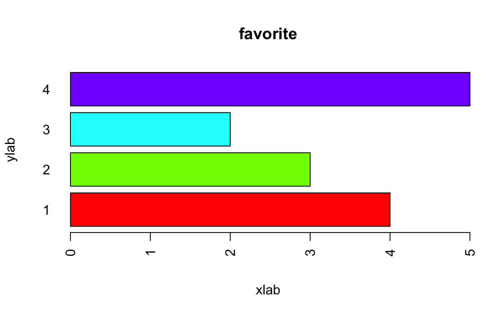

<div align="center">
<h1>이동인</h1>
<p>대림대학교 스마트소프트웨어학과 실무프로젝트(I)</p>


</div><br>

## 2023년 4월 27일

<p></p>

### 막대그래프 그리기

막대그래프 작성의 기초

-   데이터가 포함하고 있는 정보를 이해하기 쉽게 표현하는 과정을 데이터 시각화라고 한다.
-   막대그래프는 그룹별로 집계된 데이터를 표현하는 도구이기 때문에 막대그래프를 작성하기 위해서는 먼저 그룹별로 데이터를 집계하는 작업이 필요하다.
-   도수분포표 계산하기.
    ```r
    fav = c("A", "A", "A", "A", "B", "B", "B", "C", "C", "D", "D", "D", "D", "D")
    fav
    table(fav)
    ```
-   막대그래프 작성하기.
    ```r
    ds = table(fav)
    barplot(ds, main = "favorite")
    ```
-   실행 결과.
    
-   막대그래프 작성의 여러 가지 속성.
    ```r
    barplot(
      ds,
      main = "favorite",
      col = rainbow(4),                 #색상 지정
      xlab = "xlab", ylab = "ylab",     #색인 지정
      horiz = TRUE,                     #막대그래프를 수평 방향으로 출력
      names = c("1", "2", "3", "4"),    #X축 그룹의 이름 지정
      las = 2                           #X축 그룹 이름의 출력 방향 지정
      )
    ```
-   실행 결과.
    

중첩 그룹의 막대그래프

-   중첩 그룹의 막대그래프 그리기.
    ```r
    age.A = c(13709, 10974, 7979, 5000, 4250)
    age.B = c(17540, 29701, 36209, 33947, 24487)
    age.C = c(991, 2195, 5366, 12980, 19007)
    ds = rbind(age.A, age.B, age.C)
    colnames(ds) = c("1970", "1990", "2010", "2030", "2050")
    barplot(ds, main = "Population", col = rainbow(3), beside = TRUE, legend.text = TRUE)
    ```
-   실행 결과.
    
-   범례를 그래프 밖에 표시하기.
    ```r
    par(mfrow = c(1, 1), mar = c(5, 5, 5, 7))
    barplot(
        ds,
        main = "Population",
        col = rainbow(3),
        beside = TRUE,
        legend.text = TRUE,
        args.legend = list(x = "topright", bty = "n", inset = c (-0.2, 0))
        )
    ```
-   실행 결과.
    

### 히스토그램 그리기

히스토그램 작성

-   히스토그램은 외관상으로는 막대그래프와 유사하지만, 그룹이 명시적으로 존재하지 않는 수치형 자료의 분포를 시각화할 때 사용된다.
-   `hist()` 함수를 통해 히스토그램을 작성한다.
    ```r
    head(cars)
    dist = cars[, 2]
    dist
    hist(
      dist,
      main = "cars",
      xlab = "Braking distance",
      ylab = "Frequency",
      border = "blue",
      col = "green",
      las = 2,
      breaks = 5 #히스토그램의 막대 개수 조절
      )
    ```
-   실행 결과.
    
-   `cars` 데이터셋은 자동차의 주행속도에 따른 제동거리 데이터를 저장하고 있는 데이터 프레임.
-   히스토그램은 외관상 막대그래프와 유사하나 일반적으로 막대 사이에 간격이 있으면 막대그래프, 간격이 없이 붙어있으면 히스토그램이라고 구분할 수 있다.
-   막대그래프에서는 막대의 면적이 의미가 없지만, 히스토그램에서는 막대의 면적이 의미를 가진다.

구간별 빈도수를 도수분포표 형태로 출력

-   구간별 빈도수를 도수분포표 형태로 출력하기.
    ```r
    result = hist(dist, main = "cars", breaks = 5)
    freq = result$counts
    names(freq) = result$breaks[-1]
    freq
    ```

### 여러 가지 형태의 그래프

다중그래프 작성

-   하나의 창에 여러 개의 그래프를 동시에 출력해 비교할 수 있다.
    ```r
    par(mfrow = c(2, 2), mar = c(3, 3, 4, 2)) #화면 분할
    hist(iris$Sepal.Length, main = "Sepal.Length", col = "orange")
    barplot(table(mtcars$cyl), main = "mtcars", col = c("red", "green", "blue"))
    barplot(table(mtcars$gear), main = "mtcars", col = rainbow(3), horiz = TRUE)
    pie(table(mtcars$cyl), main = "btcars", col = topo.colors(3), radius=2)
    ```
-   실행 결과.
    

그래프를 파일에 저장하기

-   `plot` 창에 생성된 그래프에 우클릭 후 그래프를 복사해 다른 파일에 저장한다.
-   `plot` 창에 생성된 그래프에 우클릭 후 `Save Image as`를 클릭해 이미지로 저장한다.
-   `plot` 창의 `Export` 메뉴를 클릭하여 원하는 확장자로 저장한다.

원그래프

-   원그래프는 하나의 원 안에 데이터 값이 차지하는 비율을 넓이로 나타낸 그래프이다.
-   원그래프 작성하기.
    ```r
    fav = c("A", "A", "A", "A", "B", "B", "B", "C", "C", "D", "D", "D", "D", "D")
    ds = table(fav)
    pie(ds, main = "ABCD", radius = 1)
    ```
-   실행 결과.
    
-   원그래프 조각 색 지정하기.
    ```r
    pie(ds, main = "ABCD", col = c("brown", "green", "red", "black"), radius = 1)
    ```
-   3차원 원그래프 작성하기.
    ```r
    install.packages("plotrix")
    library(plotrix)
    pie3D(
      ds,
      main = "ABCD",
      labels = names(ds),
      labelcex = 1.0,
      explode = 0.1,
      radius = 1.5,
      col = rainbow(4)
      )
    ```
-   실행 결과.
    

선그래프

-   일반적으로 시간의 변화에 따라 수집된 데이터를 시각화하는 데 주로 사용된다.
-   시간 변화에 따라 데이터를 수집한 경우 이를 시계열 데이터라고 부른다.
-   하나의 선그래프 작성하기.
    ```r
    month = 1:12
    late = c(5, 8, 7, 9, 4, 6, 12, 13, 8, 6, 6, 4)
    plot(
        month,
        late,
        main = "Late",
        type = "l",
        lty = 1,
        lwd = 1,
        xlab = "Month",
        ylab = "Late cnt"
        )
    ```
-   실행 결과.
    

<p></p>

## 2023년 4월 13일

<p></p>

### 결과물을 파일로 출력하기

작업 폴더 지정

-   작업 폴더 지정하기.
    ```r
    setwd("")                         #경로 지정하기
    getwd()                           #출력하기
    sink("result.txt", append = T)    #파일 출력 시작
    sink()                            #파일 출력 정지
    head(test)                        #파일 출력
    ```

### 조건문

`if-else`문

-   조건에 따라 실행할 명령문.
    ```r
    if () {
        #조건이 참일 때 실행할 명령문
    } else {
        #조건이 거짓일 때 실행할 명령문
    }
    ```
-   실제 적용하기.
    ```r
    job.type <- "A"
    if (job.type == "B") {
      bonus <- 200
    } else {
      bonus <- 100
    }
    print(bonus)
    ```

### 반복문

`for`문

-   반복 범위는 반복 변수에 할당할 값을 모아둔 벡터로 이 벡터의 길이만큼 `for`문은 반복된다.
-   `for`문이 한 번씩 수행될 때마다 반복 범위의 값을 하나씩 가져와 반복 변수에 저장한 뒤 코드 블록 안에 있는 명령문을 실행한다.
    ```r
    for () {
      #반복할 명령문
    }
    ```

`while`문

-   조건에 만족할 때까지 반복문을 수행한다.
    ```r
    sum = 0
    i = -1
    while (i <= 100) {
      sum = sum + i
      i = i + 1
    }
    print(sum)
    ```

`apply()` 계열 함수

-   `apply()` 함수는 매트릭스나 데이터 프레임에 있는 행들이나 열들을 하나하나 차례로 꺼내서 평균이나 합계등을 구하는 작업을 할 때 유용하다.
    ```r
    apply(iris[,1:4], 1, mean) #행 방향으로 적용
    apply(iris[,1:4], 2, mean) #열 방향으로 적용
    ```

### 사용자 정의 함수

사용자 정의 함수

-   사용자가 스스로 정의하는 함수.
    ```r
    myMax <- function(x, y) {
      num.max <- x
      if (y > x) {
          num.max <- y
      }
      return(num.max)
    }
    ```

매개변수

-   함수명 : 사용자 정의 함수의 이름으로 사용자가 만들 수 있다.
-   매개변수 목록 : 함수에 입력할 매개변수의 이름을 지정한다.
-   실행할 명령문들 : 함수에서 처리하고 싶은 내용을 작성한다.
-   함수의 실행 결과 : 함수의 실행 결과를 반환하며, 반환 결과가 없으면 `return()` 함수를 생략한다.

<p></p>

## 2023년 4월 6일

<p></p>

### 매트릭스

행과 열에 이름 붙이기

-   `s`라는 매트릭스를 생성한 후 `s`의 내용을 출력.
    ```r
    s <- matrix(c(80, 85, 90, 95, 60, 65, 70, 75), nrow = 4)
    s
    ```
-   `rownames()` : 행의 이름을 붙이거나 행의 이름을 출력할 때 이용.
-   `colnames()` : 열의 이름을 붙이거나 열의 이름을 출력할 때 이용.

### 데이터 프레임

데이터 프레임(data frame)

-   매트릭스와 마찬가지로 2차원 형태의 데이터를 저장하고 분석하는 데 사용되는 자료 구조.
-   숫자형 자료와 문자형 자료가 결합되어 있는 형태이다.
-   데이터 프레임 만들기.
    ```r
    c <- c("A", "B", "C", "D")
    r <- c(1, 2, 3, 4)
    c.info <- data.frame(c, r)
    c.info
    ```

iris 데이터셋

-   iris는 150그루의 붓꽃에 대하여 4개 분야의 측정 데이터와 품종 정보를 결합하여 만든 데이터셋.
-   iris의 내용을 출력하는 방법은 다음과 같이 `iris`라고 입력.
-   4개의 숫자형 열과, 1개의 문자형 열이 결합.
-   데이터셋의 기본 정보 알아보기.
    | 함수명 | 설명 |
    | ------------ | --------------------------- |
    | `dim()` | 행과 열의 개수 보이기 |
    | `nrow()` | 행의 개수 보이기 |
    | `ncol()` | 열의 개수 보이기 |
    | `colnames()` | 열의 이름 보이기 |
    | `head()` | 데이터셋의 앞의 일부분 보기 |
    | `tail()` | 데이터셋의 뒷 일부분 보기 |

매트릭스와 데이터 프레임에 함수 적용

-   행별, 열별로 합계와 평균 계산하기.
    | 함수명 | 설명 |
    | ------------ | --------- |
    | `colSums()` | 열별 합계 |
    | `colMeans()` | 열별 평균 |
    | `rowSums()` | 행별 합계 |
    | `rowMeans()` | 행별 평균 |
-   행과 열의 방향 변환하기.
    ```r
    z <- matrix(1:20, nrow = 4)
    t(z)
    ```
-   x행 y열의 매트릭스를 y행 x열의 매트릭스로 변환하는 경우에 사용하는 함수가 `t()` 함수.
-   조건에 맞는 행과 열의 값 추출하기.
    ```r
    IR.1 <- subset(iris, Species == "setosa")
    IR.2 <- subset(iris, Sepal.Length > 5.0 & Sepal.Width > 4.0)
    IR.2[, c(2, 4)]
    ```
-   `subset()` : 전체 데이터에서 조건에 맞는 행들만 추출하는 기능을 제공.
-   매트릭스와 데이터 프레임에 산술연산 적용하기.
    ```r
    a <- matrix(1:20, 4, 5)
    b <- matrix(21:40, 4, 5)
    2 * a           #a에 저장된 값들에 2를 곱하기
    a + b           #a에 저장된 값들과 b에 저장된 값들의 합을 출력
    ```
-   숫자로 구성된 매트릭스나 데이터 프레임에 대해서도 같은 원리로 산술연산을 적용할 수 있다.

매트릭스와 데이터 프레임의 자료구조 확인과 변환

-   매트릭스와 데이터 프레임의 자료구조 확인하기.
    ```r
    class(iris)
    is.matrix(iris)
    is.data.frame(iris)
    ```
-   매트릭스를 데이터 프레임으로 변환하기.
    ```r
    is.matrix(state.x77)
      st <- data.frame(state.x77)
      head(st)
      class(st)
    ```
-   데이터 프레임을 매트릭스로 변환하기.
    ```r
    is.data.frame(iris[,1:4])
    iris.m <- as.matrix(iris[,1:4])
    head(iris.m)
    class(iris.m)
    ```

### 데이터 입력하고 출력하기

R에서 입력과 출력

-   R 프로그램은 분석 대상이 되는 데이터를 입력한 후 입력된 데이터를 분석하여 필요한 정보를 얻는다.
-   프로그램 내에서 데이터를 직접 입력하는 경우, 화면에서 사용자로부터 입력받는 경우, 컴퓨터에 저장된 파일이나 인터넷상에 존재하는 데이터를 가져오는 경우 등이 있다.

화면에서 데이터 입력받기

-   `svDialogs` 패키지 설치하기.
    ```r
    install.packages("svDialogs")
    library(svDialogs)
    ```
-   화면에서 데이터 입력받기.
    ```r
    user.input <- dlgInput("Input incomes")$res
    user.input
    income <- as.numeric(user.input)
    income
    tax <- income * 0.05
    cat("tax : ", tax)
    ```

`print()` 함수와 `cat()` 함수

-   화면에서 프로그램의 처리 결과를 확인하는 가장 간단한 방법은 결과가 담긴 변수의 내용을 출력하는 것.
-   `print()` 함수와 `cat()` 함수의 차이점.
    | 함수명 | 용도 | 출력 | 특징 |
    | --------- | ---------------------------------------- | ----------------------------------------------- | -------------------------------------- |
    | `print()` | 하나의 값을 출력할 때 사용됨 | 데이터 프레임과 같은 2차원 자료구조를 출력 | 출력 후 자동 줄 바꿈 |
    | `cat()` | 여러 개의 값을 연결해서 출력할 때 사용됨 | 벡터는 출력되나 2차원 자료구조는 출력할 수 없음 | 출력 후 줄 바꿈을 위해서 `\n` 입력 필요 |

### 파일을 이용해 데이터를 읽고 쓰기

작업 폴더

-   자신이 읽거나 쓰고자 하는 파일이 위치하는 폴더.
-   R에서 어떤 파일을 읽으려면 그 파일이 위치한 폴더의 경로와 함께 파일의 이름을 지정해야 함.
    ```r
    getwd()     #현재 작업 폴더
    setwd()     #작업 폴더 변경하기
    ```
-   `getwd()` : 현재 작업 폴더가 어디인지 알아보는 명령어.
-   `setwd()` : 현재 작업 폴더를 내가 원하는 폴더로 변경하는 명령어.

CSV 파일 읽기와 쓰기

-   R에서 데이터 분석을 위해 가장 많이 사용하는 파일의 형태.
-   콤마(`,`)로 열과 열을 구분한 형태.

<p></p>

## 2023년 3월 30일

<p></p>

### 자료의 종류

1차원 자료와 2차원 자료

-   1차원 자료는 단일 주제에 대한 값들을 일렬로 모아 놓은 자료.
-   2차원 자료는 복수 주제에 대한 값들을 모아 놓은 자료.
    |자료|자료구조|
    |:-|:-|
    |1차원 자료|벡터(vector), 리스트(list), 팩터(factor)|
    |2차원 자료|매트릭스(matrix), 데이터 프레임(data frame)|

범주형 자료와 수치형 자료

-   범주형 자료 : 분류의 의미를 갖는 값, 보통 문자로 표현하며 산술연산이 불가능한 값.
-   수치형 자료 : 값들이 크기를 가지며 산술연산이 가능한 값.

### 벡터 연산

벡터에 대한 산술연산

-   벡터에 대한 산술연산은 벡터 안에 포함한 값들의 하나하나의 값에 각각 실행.
    ```r
    d <- c(1, 4, 3, 7, 8)
    d * 2     #2, 8, 6, 14, 16
    d - 5     #-4, -1, -2, 2, 3
    3 * d + 4 #7, 16, 13, 25, 28
    ```

벡터와 벡터의 연산이 가능하기 위한 조건

-   두 벡터의 길이가 같아야 한다.
-   두 벡터에 포함된 값의 종류가 같아야 한다.

벡터에 적용 가능한 함수들

-   자주 사용되는 함수는 다음과 같다.
    |함수명|설명|
    |:-|:-|
    |`sum()`|합|
    |`mean()`|평균|
    |`median()`|중앙값|
    |`max()`|최댓값|
    |`min()`|최솟값|
    |`var()`|분산|
    |`sd()`|표준편차|
    |`sort()`|정렬|
    |`length()`|길이|

벡터에 논리연산자 적용

-   논리연산자는 연산의 결괏값이 참과 거짓으로 나타나는 연산자.
-   결괏값은 `TRUE`나 `FALSE`로 나타난다.
-   다음은 `d > 5`를 먼저 실행한 후 그 결과를 `sum()` 함수에 입력값으로 주어 결과를 도출하는 식이다.
    ```r
    d <- c(1:9)   #1, 2, 3, 4, 5, 6, 7, 8, 9
    #d > 5        #FALSE, FALSE, FALSE, FALSE, FALSE, TRUE, TRUE, TRUE, TRUE
    sum(d > 5)    #4
    ```
-   `d`에 저장된 값 중 5보다 큰 값의 개수를 구하는 것과 동일.

### 팩터와 리스트

팩터(factor)

-   문자형 데이터가 저장되는 벡터의 일종.
-   저장되는 값들이 어떠한 종류를 나타내는 값일 때 사용.
    ```r
    bt <- c("A", "B", "O", "AB")
    bt.new <- factor(bt)
    ```
-   `as.integer()` 함수를 이용하여 팩터의 문자값을 숫자로 바꿀 수 있음.

리스트(list)

-   자료형이 다른 값들을 한 곳에 저장하고 다룰 수 있도록 해주는 수단.
    ```r
    h.list <- c("balling", "football", "ski")
    person <- list(name = "Tom", age = 25, student = TRUE, hobby = h.list)
    person
    ```
-   리스트에 저장할 명령문이 많으면 한 줄에 작성하기가 어려워 여러 줄에 나누어 작성해야 함.

### 매트릭스

2차원 자료의 저장

-   매트릭스(matrix)와 데이터 프레임(data frame)은 2차원 자료를 저장하기 위한 대표적인 자료구조.
-   여러 개의 벡터를 모아 놓은 것이 매트릭스 또는 데이터 프레임.
-   테이블에서 가로줄 방향은 행(row)또는 관측값(observation).
-   세로줄 방향은 열(column), 칼럼 또는 변수(variable).

매트릭스 만들기

-   매트릭스의 모든 셀에 저장되는 값은 동일한 자료형이어야 함.
    ```r
    z <- matrix(1:20, nrow = 4, ncol = 5)
    z
    ```
-   `1:20` : 매트릭스에 저장될 값을 지정.
-   `nrow = 4` : 매트릭스의 행의 개수를 의미.
-   `ncol = 5` : 매트릭스의 열의 개수를 의미.

매트릭스에서 값의 추출

-   2차원 상에서 위치를 지정하려면 2개의 인덱스가 필요.
-   "몇 번째 행", "몇 번째 열"을 지정하는 2개의 인덱스 값이 필요.

<p></p>

## 2023년 3월 23일

<p></p>

### R 패키지

패키지(Package)

-   함수들을 기능별로 묶어놓은 꾸러미.
-   어떤 작업을 하느냐에 따라 필요한 패키지도 달라짐.

패키지 설치하기

-   RStudio의 콘솔에 `install.packages()` 입력.
    ```r
    install.packages("ggplot2")
    ```
-   파일 영역의 `package`탭에서 확인을 할 수 있음.

패키지 불러오기

-   RStudio의 콘솔에 `library()` 입력.
    ```r
    library(ggplot2)
    ggplot(data = iris, aes(x = Petal.length, y = Petal.width) + geom_point())
    ```

### 도움말 활용하기

도움말

-   소스 영역에서 `?`에 함수 명을 입력하면 도움말 사용 가능.
    ```r
    ?sort
    ```
-   세부사항, 값 및 참조 예제 등이 포함되어 있다.
-   `Sys.time()` : 시간

### 변수를 소개합니다

변수의 개념

-   프로그램 내에서 값을 저장해 놓을 수 있는 보관소.
-   `a`라는 변수에 `10`이라는 값을 저장하고 싶으면 아래와 같은 명령문 실행.
    ```r
    a <- 10
    ```
-   `10`을 `a`에 저장하라는 뜻이 됨.
-   하나의 변수에는 하나의 값만 저장 가능.
-   두 개 이상의 값을 저장하기 위해서는 `벡터`를 제공함.

변수의 내용 확인하기

-   `print()`, `cat()`
    ```r
    a
    print(a)
    cat(a)
    ```
-   리눅스의 명령어와 유사한 것들이 많다.

변수명 작명 규칙

-   첫 글자는 영문자나 마침표(`.`)로 시작하는데, 일반적으로 영문자로 시작.
-   두 번째 글자부터 영문자, 숫자, 마침표 및 밑줄(`_`)을 사용 가능.
-   변수명에서 대문자와 소문자는 별개의 취급.
-   변수명 중간에 빈칸을 넣을 수 없음.
-   변수명은 저장되는 값이 무엇인지 쉽게 식별할 수 있는 단어로 사용.
-   자주 사용하는 함수의 이름은 변수명으로 사용하지 않는 것이 좋음.

변수에 저장할 수 있는 값의 종류

-   숫자형 : 자연수를 포함하여 양의 정수, 음의 정수, 0, 실수 등의 값으로 산술 연산 가능
-   문자형 : 숫자형과는 달리 산술 연산을 할 수 없고, 문자형의 값은 반드시 작은따옴표(`''`)나 큰 따옴표(`""`)로 묶어 표시해야 함.
-   논리형 : 논리형 값 `true`와 `false`는 참과 거짓을 표현하는 값으로 보통 비교연산의 결과 값으로 주어짐.
-   NULL : 정의되지 않음.
-   NA : 결측값, 누락된 값을 의미.
-   NaN, Inf : 수학적으로 표현할 수 없는 값을 표현.

### 벡터를 소개합니다

10명의 학생 성적을 변수에 저장한 수 평균을 계산하는 문제

```r
score.1 <- 60; score.2 <- 65; score.3 <- 70; score.4 <- 75; score.5 <- 80;
score.6 <- 85; score.7 <- 90; score.8 <- 95; score.9 <- 100; score.10 <- 55;
total <- score.1 + score.2 + score.3 + score.4 + score.5 + score.6 + score.7 + score.8 + score.9 + score.10
avg <- total / 10
avg
```

```r
score <- c(60, 65, 70, 75, 80, 85, 90, 95, 100, 55)
mean(score) #평균 출력
```

벡터(vector)

-   R에서 제공하는 여러 개의 값을 한 번에 저장하는 기능.
-   일반적인 프로그래밍 용어로는 1차원 배열(array)이라고 함.
-   동일한 성격을 갖는 값들이 여러 개 있는 경우 이를 저장하고 처리하는 데 사용.

벡터 만들기

-   여러 자료형의 벡터 만들기
    ```r
    a <- c(1, 2, 3)
    b <- c("a", "b", "c")
    c <- c(TRUE, TRUE, FALSE)
    ```
-   연속적인 숫자로 이루어진 벡터
    ```r
    a <- 50:90
    b <- c(1, 2, 3, 50:90)
    ```
-   콜론(`;`)을 이용하여 벡터를 만드는 방법(`50:90`)은 `c()` 함수 안에서 사용 가능.
-   반복된 숫자로 이루어진 벡터
    ```r
    v5 <- rep(1, times = 5)
    v5 <- rep(c("a", "b", "c"), each = 3)
    ```
-   벡터의 값에 이름 붙이기
    ```r
    absent <- c(4, 3, 2, 1)
    names(absent) <- c("mon", "tue", "wed", "thu", "fri")
    absent
    ```

벡터에서 원소값 확인하기

-   인덱스(index) : R에서 벡터에 저장된 각각의 값들을 구분하기 위하면 앞쪽의 값부터 순서를 부여하는 것.
-   벡터에서 여러 개 값을 한 번에 출력하기
    ```r
    d <- c(1, 2, 3, 4, 5)
    d[c(1, 3, 5)]   #1, 3, 5번째 자료 출력
    d[1:3]          #1,2,3번째 자료 출력
    d[seq(1, 5, 2)] #홀수 값 출력
    d[-2]           #2번째 자료는 제외하고 출력
    d[-c(3:5)]      #3, 4, 5번째 자료는 제외하고 출력
    ```
-   이름으로 값을 출력하기
    ```r
    sales[1]
    ```
-   벡터에 저장된 원소값 변경하기
    ```r
    v1 <- c(1, 5, 7, 8, 9)
    v1[2] <- 3                  #2번째 원소의 값을 3으로 변경
    v1[c(1, 5)] <- c(10, 20)    #v1의 1, 5번째 원소의 값을 각각 10, 20으로 변경
    v1 <- c(100, 200, 300)      #v1의 값은 100, 200, 300만 남음
    ```

### 함수를 소개합니다

함수의 개념

-   함수를 포함한 식은 다음과 같이 표현.
-   어떤 값 `x`를 입력받아 정해진 계산을 수행한 후 그 결과 값 `f(x)`를 돌랴주는 장치.

함수의 매개변수

-   프로그래밍에서 함수의 입력값을 받는 변수를 매개변수(parameter)라고 함.
-   함수의 정의에 따라 매개변수를 입력하면 정의된 값을 얻을 수 있음.

<p></p>

## 2023년 3월 16일

<p></p>

### R 언어의 특징

데이터 분석에 특화된 언어

-   통계를 포함한 데이터 분석 작업에 특화.
-   Compile 과정이 없어도 됨.

탄탄한 사용자 커뮤니티

-   초보자를 위한 학습 자료가 풍부하게 존재.
-   사용자층이 두텁기 때문에 다양한 커뮤니티가 존재.

다양한 패키지(Package) 제공

-   데이터 분석에 사용되는 함수들을 종류별로 묶어 패키지 제공.
-   데이터 분석에 필요한 거의 모든 기능이 제공됨.
-   신속하게 최신 이론에 활용 가능.

미적이고 기능적인 통계 그래프 제공

-   데이터 분석에 있어서 분석 결과를 시각적으로 표현하는 게 중요.
-   `ggplot` 패키지를 제공하여 시각적으로 표현하는데 용이함.

편리한 개발 환경

-   모든 작업을 RStudio 내에서 처리 가능.
-   Open Source.
-   정기적인 유지보수.

### R을 배우는 이유

-   4차 산업혁명의 중심은 데이터.
-   시대적 흐름은 데이터를 잘 다룰 줄 아는 기업과 개인이 경쟁에서 우위를 점령 가능.
-   R은 배우기 쉬우면서도 강력한 데이터 처리 및 분석 능력을 제공.
-   프로그래밍 언어로 개발 사고를 기르기에도 적합함.

### RStudio 설치

R 설치

```zsh
brew install r
```

RStudio 설치

```zsh
brew install --cask rstudio
```

### RStudio의 화면구성

소스 영역

-   R 명령문을 작성하고 실행하는 영역.
-   문서 편집기와 유사함.

콘솔 영역

-   소스 영역에서 작성한 R 명령문을 실행시켰을 때 명령문의 실행 과정 및 결과가 표시되는 영역.
-   명령어 해석기 기능을 제공.

환경 영역

-   R 명령문이 실행되는 동안 생성되는 변수 및 자료구조의 내용을 보여주는 영역.
-   RStudio에서 실행한 명령문, 결과, 패키지 설치 및 오류 등 작업 과정의 이력이 표시.

파일 영역

-   파일탐색기 및 Finder와 동일한 역할을 수행.
-   RStudio로 파일을 불러오거나 복사, 삭제, 이동 등의 작업을 수행할 수 있음.
-   R 명령문으로 작성한 그래프가 표시되는 영역.
-   R에서는 수많은 함수들을 제공하고 이러한 함수들은 작성 목적이나 개발자에 따라 패키지 형태로 묶여 제공.

### R 명령문

대입 연산자

-   `<-`
    ```r
    a <- 10
    ```

출력

-   `print()`
    ```r
    print(a)
    ```

산술연산자

-   Compile을 통해 실행 파일을 만들지 않고 명령문을 바로 실행하는 interpreter 언어.
-   `+`, `-`, `*`, `/`, `%%`, `^`
-   함수를 이용하여 연산 가능.
    ```r
    log()
    max()
    min()
    ```

주석

-   주석 안의 내용은 무시되어 프로그램에 영향을 주지 않음.
    ```r
    # These are comments
    ```

실행

-   모든 명령문 실행 : `command` + `option` + `R`
-   한 줄에 여러 명령문 작성 시 명령문 사이에 `;`입력.
    ```r
    3 + (4 * 5); A <- 50:80; print(A)
    ```

<p></p><br>

---

<br>
<div align="center">
<p>대림대학교 스마트소프트웨어학과 실무프로젝트(I)</p>
<a href="https://hits.seeyoufarm.com"></a>
</div><br>

[def]: 0.png
